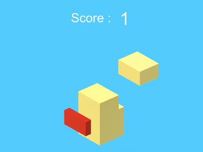

# Skyscrap

A small Unity game created in 2018.  

You can play it here: https://lombardidelavega.itch.io/skyscrap

This project is published for archival purposes.

## Project Analysis
This project was developed as an exercise.  
With my current perspective, two things stand out as problematic:

- **Static Dependencies**: The code relies heavily on static members and methods (GameManager.IsPlayerDead, Floor.CurrentFloor), creating tight coupling between components. 
A more modular approach using dependency injection would improve testability and maintainability.

- **Limited Separation of Concerns**: Game logic, UI, and state management are intermingled in the same scripts. A cleaner architecture would separate these concerns into distinct layers (e.g., Model-View-Controller pattern).

After all, this is clearly a prototype. I don't look at this old project with a harsh eye because I believe that for this kind of prototyping project with no production ambitions, execution speed is what matters most.
